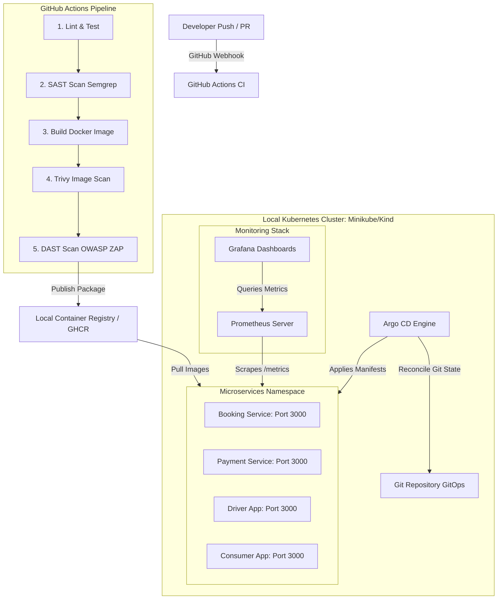

# End-to-End DevOps & SRE Microservices Project

This repository contains an end-to-end DevOps & SRE project designed for a local Kubernetes environment (Minikube, Kind, or Docker Desktop) to avoid cloud charges, while preserving production-grade GitOps (Argo CD), infrastructure configuration patterns, security pipelines, and observability.

---

## 1. System Architecture

The following diagram illustrates the pipeline execution flow, container delivery, and local GitOps deployment model.



### Alternatively, Text-Based Architecture Diagram
```text
 +-------------------+
 |  Developer Push   |
 +---------+---------+
           | (Webhook Event)
           v
 +-----------------------------------------------------------------+
 |                    GitHub Actions CI Pipeline                   |
 |                                                                 |
 |  [1. Lint & Test] --> [2. SAST (Semgrep)] --> [3. Docker Build] |
 |                                                      |          |
 |  [5. DAST (OWASP ZAP)] <-- [4. Trivy Image Scan] <---+          |
 +---------------------------------+-------------------------------+
                                   | (Build & Scan OK)
                                   v
             +---------------------+---------------------+
              |  Local Container Registry / GHCR           |
             +---------------------+---------------------+
                                   |
                                   | (Pulls Verified Images)
                                   v
 +-----------------------------------------------------------------+
 |            Local Kubernetes Cluster (Minikube/Kind)             |
 |                                                                 |
 |   Git Repository (GitOps) <---------+                           |
 |                                     | (Pull Manifests)          |
 |                               v-----+-----v                     |
 |                               |  Argo CD  |                     |
 |                               +-----+-----+                     |
 |                                     |                           |
 |                                     | (Reconciles State)        |
 |                                     v                           |
 |  +-----------------------------------------------------------+  |
 |  | Namespace: microservices                                  |  |
 |  |                                                           |  |
 |  |  [booking-service]  [payment-service]                     |  |
 |  |  [driver-app]       [consumer-app]                        |  |
 |  +---------------+-------------------------------------------+  |
 |                  ^                                              |
 |                  | (Scrapes Metrics / HTTP Probes)              |
 |  +---------------+-------------------------------------------+  |
 |  | Namespace: monitoring                                     |  |
 |  |                                                           |  |
 |  |  [Prometheus Server] <------- [Grafana Dashboards]        |  |
 |  +-----------------------------------------------------------+  |
 +-----------------------------------------------------------------+
```

---

## 2. Directory Structure

- **[.github/workflows/](file:///Users/sri/Documents/DevOps_project/.github/workflows)**: Reusable and environment-specific CI/CD workflows.
- **[src/](file:///Users/sri/Documents/DevOps_project/src)**: Application codebases, Dockerfiles, unit tests, and ESLint configurations.
- **[helm/](file:///Users/sri/Documents/DevOps_project/helm)**: Reusable Helm charts and environment value overrides.
- **[argocd/](file:///Users/sri/Documents/DevOps_project/argocd)**: Application declarations for declarative GitOps syncs.
- **[monitoring/](file:///Users/sri/Documents/DevOps_project/monitoring)**: Prometheus stack custom values, alerting rules, and Grafana dashboard models.
- **[terraform/](file:///Users/sri/Documents/DevOps_project/terraform)**: Azure cloud fallback configurations with Checkov and Snyk scan guidelines.
- **[sre/](file:///Users/sri/Documents/DevOps_project/sre)**: Incident simulation tools and disaster response runbooks.

---

## 3. Local Kubernetes Cluster Setup

### Step A: Start your Cluster (Minikube)
Start minikube specifying the ingress and metrics-server addons:
```bash
minikube start --cpus=4 --memory=8192
minikube addons enable ingress
minikube addons enable metrics-server
```

*Note: If using **Kind**, run `kind create cluster --config kind-config.yaml` with ingress ports mapped.*

### Step B: Setup Local Container Image Registry
To run local builds without pushing to a remote registry (GHCR/ACR), point your shell to Minikube's Docker daemon:
```bash
eval $(minikube -p minikube docker-env)
```
Any `docker build` command run in this terminal will save the image directly to Minikube's internal registry.

Build all 4 microservice images:
```bash
docker build -t local/booking-service:dev-latest src/booking-service/
docker build -t local/payment:dev-latest src/payment/
docker build -t local/driver-app:dev-latest src/driver-app/
docker build -t local/consumer-app:dev-latest src/consumer-app/
```

---

## 4. GitOps Deployment (Argo CD)

### Step A: Install Argo CD
Create the namespace and apply the Argo CD installation manifests:
```bash
kubectl create namespace argocd
kubectl apply -n argocd -f https://raw.githubusercontent.com/argoproj/argo-cd/stable/manifests/install.yaml
```

Wait for pods to be ready:
```bash
kubectl wait --namespace argocd --for=condition=ready pod --selector=app.kubernetes.io/name=argocd-server --timeout=90s
```

### Step B: Configure Local Image Overrides
When using local images, update your Helm values or Argo CD app parameters to use `local/` repositories and the `dev-latest` tag.

Apply the Dev applications configuration:
```bash
kubectl apply -f argocd/dev-apps.yaml
```

To access the Argo CD dashboard:
```bash
kubectl port-forward svc/argocd-server -n argocd 8080:443
```
*Login with user `admin` and get the password via:*
```bash
kubectl -n argocd get secret argocd-initial-admin-secret -o jsonpath="{.data.password}" | base64 --decode
```

---

## 5. Monitoring Setup (Prometheus & Grafana)

We use the Prometheus Operator to manage scraping and alerting:

### Step A: Add Prometheus Community Helm Repository
```bash
helm repo add prometheus-community https://prometheus-community.github.io/helm-charts
helm repo update
```

### Step B: Deploy Kube-Prometheus-Stack
```bash
kubectl create namespace monitoring
helm install prometheus prometheus-community/kube-prometheus-stack \
  --namespace monitoring \
  -f monitoring/values-prometheus-stack.yaml
```

### Step C: Apply Custom Alerting Rules
Apply the rules definition for high error rates and latency:
```bash
kubectl apply -f monitoring/prometheus-rules.yaml -n monitoring
```

### Step D: Access Grafana Dashboard
Access the dashboard to view the **Microservices SRE Golden Signals Dashboard**:
```bash
kubectl port-forward svc/prometheus-grafana -n monitoring 3001:80
```
- Open `http://localhost:3001` in your browser.
- Login with Username: `admin` / Password: `admin-sre-secure` (as defined in [values-prometheus-stack.yaml](file:///Users/sri/Documents/DevOps_project/monitoring/values-prometheus-stack.yaml)).

---

## 6. SRE Incident Playgrounds
To practice incident response, navigate to the SRE workspace instructions:
- **[SRE System Guide & Scripts](file:///Users/sri/Documents/DevOps_project/sre/README.md)**: Details how to inject latency, memory leaks, and error spikes.
- **[Booking Latency Runbook](file:///Users/sri/Documents/DevOps_project/sre/runbooks/booking-latency.md)**: Manual for responding to latency issues.
- **[Payment OOM Runbook](file:///Users/sri/Documents/DevOps_project/sre/runbooks/payment-oom.md)**: Manual for responding to memory leaks.
